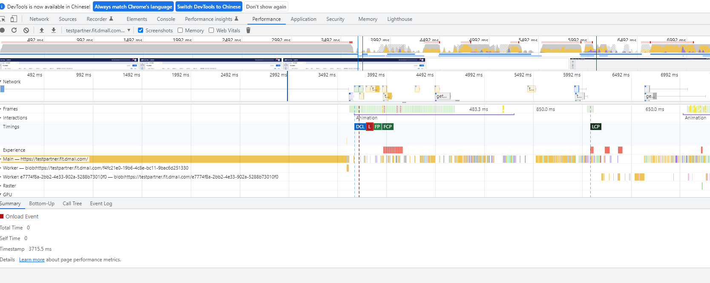
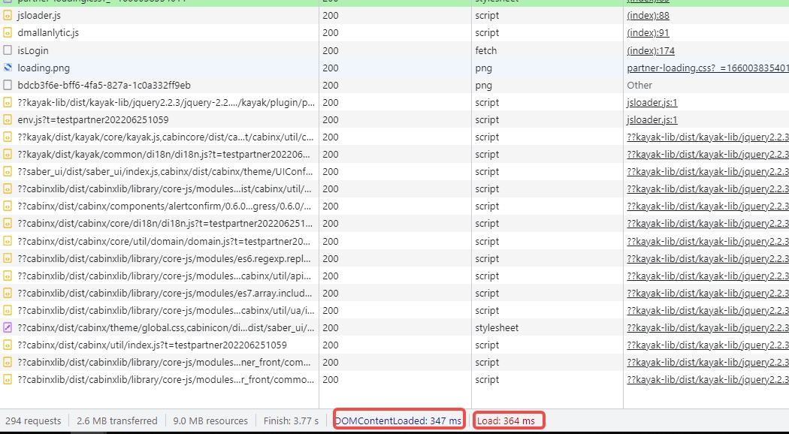
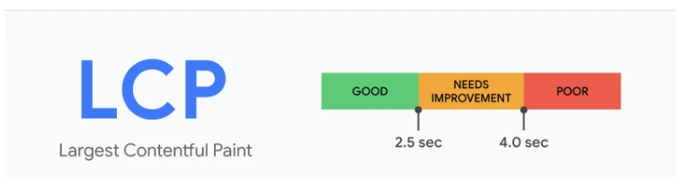
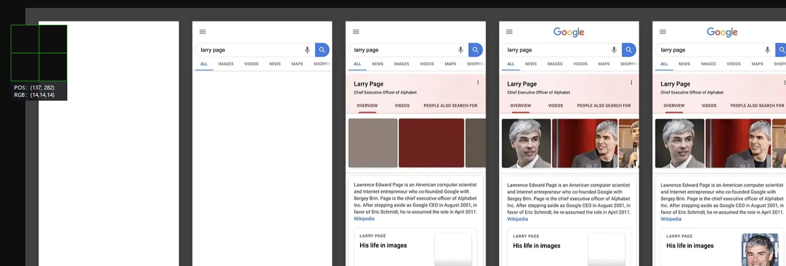

# H5页面性能初探🌕

## 背景：

​		近期在做一些H5在性能差的硬件设备上运行的技术方案评估的时候。我需要通过在这些设备上跑H5页面来得出一些性能数据。所以我和小伙伴儿使用Vue3+Antd写了一个基本的B端页面在设备上跑了一下，并和公司的之前的B端H5页面进行了一些数据对比，结果让我挺惊讶😨的。不多说了，兄弟们我给你们上数据。

Vue3+Antd的单页面应用：2.6s的首屏加载时间。

公司的页面：16s的首屏加载时间。

## 性能指标

​		Hi，兄弟们。如果让你来测一个页面的性能你们会用啥来测呢？我最开始可牛逼了，直接肉体感知知道吧，就是**人肉读秒**😭。之后才使用了Chrome Devtool Performance ——(常用的页面性能分析工具)。当你也使用它来分析页面加载性能的时候会生成如下图所示的报告。DCL、Load、FP、FCP、LCP。(看到这五个指标我相信你也会像我最开始那样纳闷，所以我开始了我的学习之旅😀)

### DCL(DOMContentLoaded Event)

当初始 HTML 文档完全加载和解析时触发该**`DOMContentLoaded`**事件，无需等待样式表、图像和子框架完成加载。

此事件的原始目标是[`Document`](https://developer.mozilla.org/en-US/docs/Web/API/Document)已加载的。您可以在接口上侦听此事件，`Window`以便在捕获或冒泡阶段进行处理。有关此活动的完整详细信息，请参阅文档页面：[`DOMContentLoaded`](https://developer.mozilla.org/en-US/docs/Web/API/Document/DOMContentLoaded_event)活动。

一个不同的事件，[`load`](https://developer.mozilla.org/en-US/docs/Web/API/Window/load_event)，应该只用于检测一个完全加载的页面。在更合适的`load`地方使用是一个常见的错误。`DOMContentLoaded`

### Load（onLoad）

该**`load`**事件在整个页面加载后触发，包括所有相关资源，例如样式表和图像。这与 DOM 不同[`DOMContentLoaded`](https://developer.mozilla.org/en-US/docs/Web/API/Document/DOMContentLoaded_event)，它在页面 DOM 加载后立即触发，无需等待资源完成加载。

此事件不可取消且不会冒泡。

### FP:首次绘制

 `First Paint`：是页面导航与浏览器的网页的第一个输入与浏览器的网页的第一个渲染到导航屏幕上所时，渲染是任何屏幕的内容

### FCP：首次内容绘制

 `First Contentful Paint`：浏览器从 DOM 渲染第一个内容，向用户提供页面实际加载的第一个反馈。从开始加载到页面内容的任意部分在屏幕上渲染出来的时间。就是首批文本和图像元素在屏幕上完成渲染的时间点。

### **FMP：首次有效绘制**

 `First Meaningful Paint`：首次有效绘制，标记主角元素渲染完成的时间点，主角元素可以是视频网站的视频控件，内容网站的页面框架也可以是资源网站的头图等

### LCP：最大内容绘画 

 `Largest Contentful Paint`：最大内容绘画（LCP）度量标准报告视口内可见的最大图像或文本块的渲染时间。

从历史上看，Web开发人员衡量网页主要内容的加载速度和对用户可见的速度一直是一个挑战。

较旧的指标（例如load或DOMContentLoaded）不好，因为它们不一定与用户在屏幕上看到的相对应。 而且，以用户为中心的更新性能指标（例如First Contentful Paint（FCP））只能捕捉到加载体验的最开始。 如果页面显示启动画面或显示加载指示器，则此刻与用户无关。

有时越简单越好。 根据W3C网络性能工作组的讨论和Google的研究，我们发现，衡量何时加载页面主要内容的一种更准确的方法是查看何时呈现了最大的元素.

### **TTI：页面可交互时间**

 `Time to Interactive`：页面可交互时间，即从页面开始加载，一直到用户可以自由输入或操作页面的时间

在上方的加载中，

 `FCP` 发生在第二帧， `FMP` 发生在第三帧， `LCP` 发生在第四帧， `TTI`发生在第五帧。

因为那是首批文本和图像元素在屏幕上完成渲染的时间点。虽然部分内容已完成渲染，但并非所有内容都已经完成渲染。

这是首次内容绘制 (FCP) 与Largest Contentful Paint 。最大内容绘制 (LCP) （旨在测量页面的主要内容何时完成加载）之间的重要区别。网站应该努力将FCP控制在**1.8 秒**或以内。

